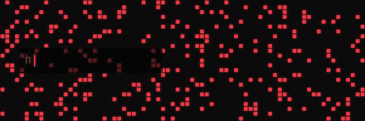

# Hi, I'm Jae. 👋

CS undergrad who builds things that probably shouldn't work — and somehow makes them work anyway.
Currently writing a thesis on AI safety (yes, I'm trying to stop AI from going rogue, no it's not going well),
fresh off **3 back-to-back hackathons**, and still convinced sleep is optional.

I love breaking things on purpose just to understand them. I automate whatever I can before it becomes boring.
I ship before it's perfect because "almost done" is a lie I've told myself too many times.

### 🛠️ Tech Stack

**Languages:**

**Frontend:**

**Backend & Databases:**

**Currently Exploring:** `AI Safety` | `Supabase` | `Advanced Algorithms` | `Things I probably shouldn't touch`

### 🏆 Three Hackathons. One Month. Zero Regrets.

Built some stuff, broke some stuff, presented to judges while running on energy drinks and spite.
Projects are a mix of public and private repos — hit me up if you're curious.

### 📊 GitHub Stats

  
  &nbsp;
  

 

  <picture>
    <source media="(prefers-color-scheme: dark)" srcset="https://raw.githubusercontent.com/JaePyJs/JaePyJs/output/github-contribution-grid-snake-dark.svg">
    <source media="(prefers-color-scheme: light)" srcset="https://raw.githubusercontent.com/JaePyJs/JaePyJs/output/github-contribution-grid-snake.svg">
    
  </picture>

### 📫 Let's Connect

&nbsp;

